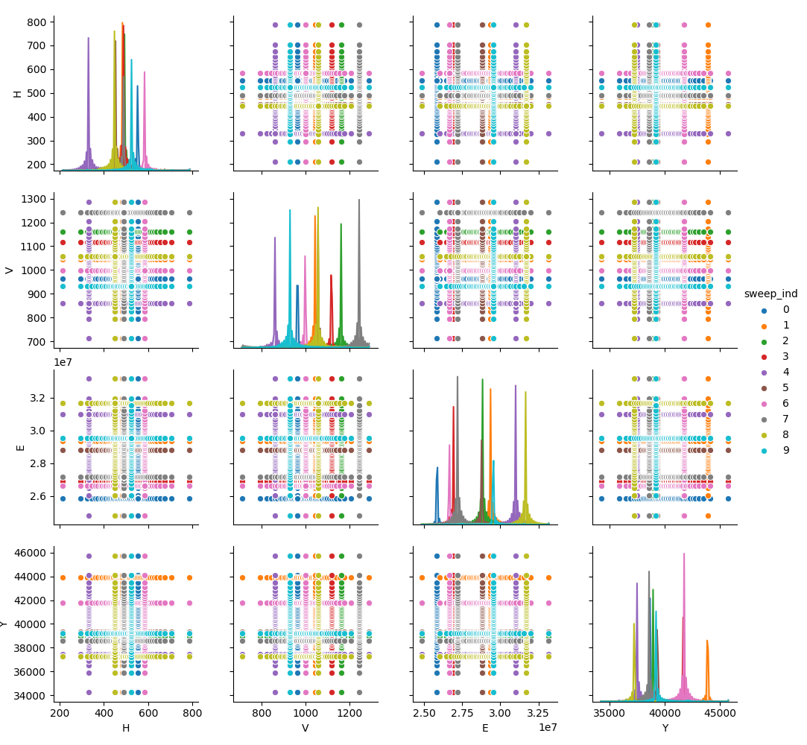
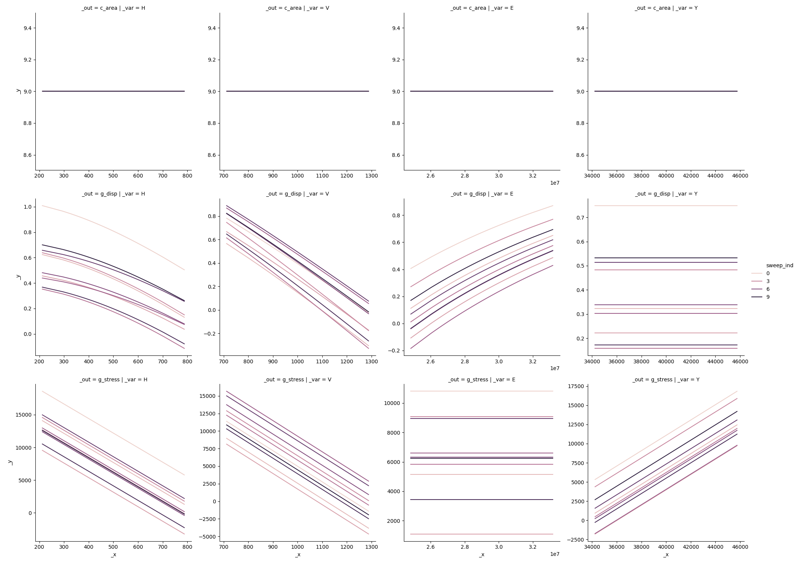

# Language Details

---

The following is a fairly extensive introduction to the *grama* language. This
is (admittedly) not a great place to start learning how to *use* `py_grama`, but
is instead provided as a reference.

*grama* is a conceptual language, and `py_grama` is a code implementation of
that concept. This page is a description of both the concept and its
implementation.

## Running example

We'll use a running example throughout this page; the built-in `py_grama` Cantilever Beam model.

```python
import grama as gr
from grama.models import make_cantilever_beam

md_beam = make_cantilever_beam()
md_beam.printpretty()
```

```bash
model: Cantilever Beam

  inputs:
    var_det:
      w: [2, 4]
      t: [2, 4]
    var_rand:
      H: (+1) norm, {'loc': 500.0, 'scale': 100.0}
      V: (+1) norm, {'loc': 1000.0, 'scale': 100.0}
      E: (+0) norm, {'loc': 29000000.0, 'scale': 1450000.0}
      Y: (-1) norm, {'loc': 40000.0, 'scale': 2000.0}
  functions:
    cross-sectional area: ['w', 't'] -> ['c_area']
    limit state: stress: ['w', 't', 'H', 'V', 'E', 'Y'] -> ['g_stress']
    limit state: displacement: ['w', 't', 'H', 'V', 'E', 'Y'] -> ['g_disp']
```

## Objects

*grama* focuses on two categories of objects:

- **data** (`df`): observations on various quantities, implemented by the Python package [Pandas](https://pandas.pydata.org/)
- **models** (`md`): functions and a complete description of their inputs, implemented by [py_grama](https://github.com/zdelrosario/py_grama)

For readability, we suggest using prefixes `df_` and `md_` when naming DataFrames and models.

### Data

Data are observations on some quantities. Data often come from the real world,
but data are also used to inform models, and models can be used to generate new
data. `py_grama` uses the Pandas `DataFrame` implementation to represent data.
Since data operations are already well-handled by Pandas, `py_grama` uses the
existing Pandas infrastructure and focuses on providing tools to handle models
and their interface with data.

### Models

Models in *grama* have both functions and inputs. `py_grama` implements models
in the `Model` class, which in turn have three primary objects:

- `Domain`: Defines bounds on variables
- `Density`: Defines a joint density for variables
- List of`Function`s: Maps variables to outputs

#### Domain

The domain of the model defines bounds for all the variables. If a variable is
not included in the domain object, it is assumed to be unbounded. The model
above has bounds on `t, w`, both of which are `[2, 4]`.

#### Density

The density of the model defines a joint density for the *random* variables. If
a variable is included in the density it is random, otherwise it is
*deterministic*. The model above has a joint density on `H, V, E, Y`.
The model summary gives details on each marginal distribution.

#### Functions

A function has a set of variables, which map to a set of outputs; for instance,
the `cross-sectional area` function above maps `['w', 't'] -> ['c_area']`. The
other functions take more variables, all of which map to their respective
outputs.

#### Inputs

The full set of model inputs are organized into:

|            | Deterministic                         | Random     |
| ---------- | ------------------------------------- | ---------- |
| Variables  | `md.var_det`                          | `md.var_rand` |
| Parameters | `md.density.marginals[var].d_param`   | (Future*)  |

- **Variables** are inputs to the model's functions
  + **Deterministic** variables are chosen by the user; the model above has `w, t`
  + **Random** variables are not controlled; the model above has `H, V, E, Y`
- **Parameters** are inputs to the model's density
  + **Deterministic** parameters are currently implemented; these are listed under `var_rand` with their associated random variable
  + **Random** parameters* are not yet implemented

The full set of *variables* is determined by the domain, density, and functions.
Formally, the full set of variables is given (in pseudocode) by `domain.var +
[f.var for f in functions]`. The set of random variables is then given by
`domain.var + [f.var for f in functions] - density.marginals.keys()`, while the
deterministic variables are the remainder `var_det = var_full - var_rand`.

## Verbs

Verbs are used to take action on different *grama* objects. We use verbs to
generate data from models, build new models from data, and ultimately make sense
of the two.

The following table summarizes the categories of `py_grama` verbs. Verbs take
either data (`df`) or a model (`md`), and may return either object type. The
prefix of a verb immediately tells one both the input and output types. The
short prefix is used to denote the *pipe-enabled version* of a verb.

| Verb Type | Prefix (Short)  | In   | Out   |
| --------- | --------------- | ---- | ----- |
| Evaluate  | `eval_` (`ev_`) | `md` | `df`  |
| Fit       | `fit_`  (`ft_`) | `df` | `md`  |
| Transform | `tran_` (`tf_`) | `df` | `df`  |
| Compose   | `comp_` (`cp_`) | `md` | `md`  |
| Plot      | `plot_` (`pt_`) | `df` | (Plot) |

Since `py_grama` is focused on models, the majority of functions lie in the
Evaluate, Fit, and Compose categories, with only a few original Transform
utilities provided. Some shortcut plotting utilities are also provided
for covenience.

`py_grama` verbs are used to both *build* and *analyze* models.

### Model Building

The *recommended* way to build `py_grama` models is with *composition calls*.
Calling `Model()` creates an "empty" model, to which one can add.

```python
md = gr.Model()
md.printpretty()
```

```bash
model: None

  inputs:
    var_det:
    var_rand:
  functions:
```

We can then use Compose functions to build up a complete model step-by step. We
recommend starting with the functions, as those highlight the required
variables.

```python
md = gr.Model("Test") >> \
     gr.cp_function(
         fun=lambda x: [x[0], x[1]],
         var=["x0", "x1"],
         out=2,
         name="Identity"
     )
md.printpretty()
```

```bash
model: Test

  inputs:
    var_det:
      x0: (unbounded)
      x1: (unbounded)
    var_rand:
  functions:
    Identity: ['x0', 'x1'] -> ['y0', 'y1']
```

Note that by default all of the variables are assumed to be deterministic. We
can override this by adding marginal distributions for one or more of the
variables.

```python
md = gr.Model("Test") >> \
     gr.cp_function(
         fun=lambda x: [x[0], x[1]],
         var=["x0", "x1"],
         out=2,
         name="Identity"
     ) >> \
     gr.cp_marginals(
         x1=dict(dist="norm", loc=0, scale=1)
     )
md.printpretty()
```

```bash
model: Test

  inputs:
    var_det:
      x0: (unbounded)
    var_rand:
      x1: (+0) norm, {'loc': 0, 'scale': 1}
  functions:
    Identity: ['x0', 'x1'] -> ['y0', 'y1']
```

The marginals are implemented in terms of the Scipy [continuous
distributions](https://docs.scipy.org/doc/scipy/reference/stats.html); see the
variable `gr.valid_dist.keys()` for a list of implemented marginals. When
calling `gr.comp_marginals()`, we provide the target variable name as a keyword
argument, and the marginal information via dictionary. The marginal shape is
specified with the "dist" keyword; all distributions require the `loc, scale`
parameters, but some require additional keywords. See `gr.param_dist` for a
dictionary mapping between distributions and parameters.

Once we have constructed our model, we can analyze it with a number of tools.

### Model Analysis

One question in model analysis is to what degree the random variables affect the
outputs. A way to quantify this is with *Sobol' indices* (Sobol', 1999). We
can estimate Sobol' indices in `py_grama` with the following code.

```python
df_sobol = \
    md_beam >> \
    gr.ev_hybrid(n=1e3, df_det="nom", seed=101) >> \
    gr.tf_sobol()
print(df_sobol)
```

```bash
eval_hybrid() is rounding n...
     w    t  c_area     g_stress  g_disp  ind
0  NaN  NaN     NaN        -0.03    0.28  S_E
0  NaN  NaN     NaN         0.35    0.21  S_H
0  NaN  NaN     NaN         0.33    0.64  S_V
0  NaN  NaN     NaN         0.31    0.02  S_Y
0  0.0  0.0     0.0   -345263.39    0.01  T_E
0  0.0  0.0     0.0   4867712.30    0.01  T_H
0  0.0  0.0     0.0   4577175.85    0.02  T_V
0  0.0  0.0     0.0   4224965.01    0.00  T_Y
0  0.0  0.0     0.0  13758547.04    0.04  var
```

The normalized Sobol' indices are reported with `S_[var]` labels; they indicate
that `g_stress` is affected roughly equally by the inputs `H,V,Y`, while
`g_disp` is affected about twice as much by `V` as by `E` or `H`. Note that the
Sobol' indices are *only* defined for the random variables---since Sobol'
indices are defined in terms of fractional variances, they are only formally
valid for quantifying contributions from sources of randomness.

Under the hood `gr.eval_hybrid()` attaches metadata to its resulting DataFrame,
which `gr.tran_sobol()` detects and uses in post-processing the data.

`py_grama` also provides tools for constructing visual summaries of models. We
can construct a *sinew plot* with a couple lines of code. First we inspect the
design:

```python
md_beam >> \
    gr.ev_sinews(n_density=50, n_sweeps=10, df_det="nom", skip=True) >> \
    gr.pt_auto()
```



The "sinews" are sweeps across random variable space which start at random
locations, and continue parallel to the variable axes. Evaluating these
samples allows us to construct a sinew plot:

```python
md_beam >> \
    gr.ev_sinews(n_density=50, n_sweeps=10, df_det="nom", skip=False) >> \
    gr.pt_auto()
```



Here we can see that inputs `H,E` tend to saturate in their effects on `g_disp`,
while `V` is linear over its domain. This may explain the difference in
contributed variance seen above via Sobol' indices.

By providing tools to quickly perform different analyses, one can quickly get a
sense of model behavior using `py_grama`.

## Layers and Defaults

`py_grama` is built around *layers and defaults*. As much as is possible
`py_grama` is designed to provide sensible defaults "out-of-the-box". We saw the
concept of *layers* above in the model building example. The following example
shows defaults in action.

### Example Defaults: `gr.eval_monte_carlo()`

Attempting to provide no arguments to `gr.eval_monte_carlo()` yields the
following error:

```python
df_res = md_beam >> gr.ev_monte_carlo()
```

```bash
...
ValueError: df_det must be DataFrame or 'nom'
```

One can sample over the random variables given their joint density, but this
tells us nothing about how to treat the deterministic variables. The error
message above tells us that we have to define the deterministic variable levels
through `df_det`. To perform simple studies, we can explicitly limit attention
to the nominal conditions.

```python
df_res = md_beam >> gr.ev_monte_carlo(df_det="nom")
print(df_res.describe())
```

```bash
                H           V             E  ...  c_area    g_stress    g_disp
count    1.000000    1.000000  1.000000e+00  ...     1.0     1.00000  1.000000
mean   505.743982  906.946892  2.824652e+07  ...     9.0  9758.06826  0.438044
std           NaN         NaN           NaN  ...     NaN         NaN       NaN
min    505.743982  906.946892  2.824652e+07  ...     9.0  9758.06826  0.438044
25%    505.743982  906.946892  2.824652e+07  ...     9.0  9758.06826  0.438044
50%    505.743982  906.946892  2.824652e+07  ...     9.0  9758.06826  0.438044
75%    505.743982  906.946892  2.824652e+07  ...     9.0  9758.06826  0.438044
max    505.743982  906.946892  2.824652e+07  ...     9.0  9758.06826  0.438044

[8 rows x 9 columns]
```

By default `gr.eval_monte_carlo()` will draw a single sample; this leads to the
`NaN` standard deviation (`std`) results. We can override this default behavior
by providing the `n` keyword.

```python
df_res = md_beam >> gr.ev_monte_carlo(df_det="nom", n=1e3)
print(df_res.describe())
```

```bash
eval_monte_carlo() is rounding n...
                 H            V             E  ...  c_area      g_stress       g_disp
count  1000.000000  1000.000000  1.000000e+03  ...  1000.0   1000.000000  1000.000000
mean    499.776481  1001.908814  2.899238e+07  ...     9.0   6589.731053     0.333387
std     100.878972   102.929434  1.523033e+06  ...     0.0   3807.292688     0.199576
min     168.466610   635.220875  2.427615e+07  ...     9.0  -5830.363269    -0.339594
25%     433.466349   933.698938  2.799035e+07  ...     9.0   3921.581411     0.200657
50%     500.201964  1002.514072  2.896188e+07  ...     9.0   6633.083925     0.339702
75%     569.159912  1065.489928  2.993924e+07  ...     9.0   9161.066426     0.465231
max     798.543698  1327.618914  3.378264e+07  ...     9.0  18682.531892     1.045742

[8 rows x 9 columns]
```

Formally `1e3` is a float, which is not a valid iteration count. The routine
`gr.eval_monte_carlo()` informs us that it first rounds the given value before
proceeding. Here we can see some variation in the inputs and outputs, though
`c_area` is clearly unaffected by the randomness.

We can also provide an explicit DataFrame to the `df_det` argument. The
`gr.eval_monte_carlo()` routine will automatically take an *outer product* of
the deterministic settings with the random samples; this will lead to a
multiplication in sample size of `df_det.shape[0] * n`. Since this can get quite
large, we should reduce `n` before proceeding. We can also *delay evaluation*
first with the `skip` keyword, and inspect the design first before evaluating
it.

```python
df_det = pd.DataFrame(dict(
    w=[3] * 10,
    t=[2.5 + i/10 for i in range(10)]
))

df_design = md_beam >> gr.ev_monte_carlo(df_det=df_det, n=1e2, skip=True)
print(df_design.describe())
```

```bash
eval_monte_carlo() is rounding n...
                 H            V             E             Y       w            t
count  1000.000000  1000.000000  1.000000e+03   1000.000000  1000.0  1000.000000
mean    485.021539   989.376268  2.890355e+07  40135.172902     3.0     2.950000
std     112.546373    92.381768  1.462286e+06   2135.788506     0.0     0.287372
min     137.606474   764.764234  2.586955e+07  33320.789307     3.0     2.500000
25%     411.652958   927.448139  2.763002e+07  39104.255172     3.0     2.700000
50%     490.765903  1002.513232  2.903287e+07  40121.853496     3.0     2.950000
75%     561.317283  1046.038620  2.994359e+07  41279.345157     3.0     3.200000
max     726.351812  1239.473097  3.176696e+07  45753.627265     3.0     3.400000
```

If we are happy with the design (possibly after visual inspection), we can
pass the input DataFrame to the straight evaluation routine

```python
df_res = md_beam >> gr.ev_df(df=df_design)
print(df_res.describe())
```

```bash
                 H            V             E  ...       c_area      g_stress       g_
disp
count  1000.000000  1000.000000  1.000000e+03  ...  1000.000000   1000.000000  1000.00
0000
mean    510.457048  1003.972079  2.887534e+07  ...     8.850000   4555.508097     0.12
0805
std     105.566743    91.443354  1.486829e+06  ...     0.862116   7027.137049     0.59
9538
min     269.102628   830.234813  2.553299e+07  ...     7.500000 -18370.732185    -1.84
8058
25%     437.342719   939.490354  2.794973e+07  ...     8.100000   -385.620306    -0.29
7274
50%     515.387982   995.468715  2.868415e+07  ...     8.850000   5347.337598     0.23
2133
75%     584.899669  1054.815972  2.982724e+07  ...     9.600000   9824.615141     0.60
9096
max     775.221819  1257.095025  3.369872e+07  ...    10.200000  21238.954122     1.23
6387

[8 rows x 9 columns]
```

## Functional Programming (Pipes)

[Functional programming](https://en.wikipedia.org/wiki/Functional_programming)
touches both the practical and conceptual aspects of the language. `py_grama`
provides tools to use functional programming patterns. Short-stem versions of
`py_grama` functions are *pipe-enabled*, meaning they can be used in functional
programming form with the pipe operator `>>`. These pipe-enabled functions are
simply aliases for the base functions, as demonstrated below:

```python
df_base = gr.eval_nominal(md_beam, df_det="nom")
df_functional = md_beam >> gr.ev_nominal(df_det="nom")

df_base.equals(df_functional)
```

```bash
True
```

Functional patterns enable chaining multiple commands, as demonstrated in the
following Sobol' index analysis. In nested form using base functions, this would
be:

```python
df_sobol = gr.tran_sobol(gr.eval_hybrid(md_beam, n=1e3, df_det="nom", seed=101))
```

From the code above, it is difficult to see that we first consider `md_beam`, perform a hybrid-point evaluation, then use those data to estimate Sobol' indices. With more chained functions, this only becomes more difficult. One could make the code significantly more readable by introducing intermediate variables:

```python
df_samples = gr.eval_hybrid(md_beam, n=1e3, df_det="nom", seed=101)
df_sobol = gr.tran_sobol(df_samples)
```

Conceptually, using *pipe-enabled* functions allows one to skip assigning intermediate variables, and instead pass results along to the next function. The pipe operator `>>` inserts the results of one function as the first argument of the next function. A pipe-enabled version of the code above would be:

```python
df_sobol = \
    md_beam >> \
    gr.ev_hybrid(n=1e3, df_det="nom", seed=101) >> \
    gr.tf_sobol()
```

## References

- I.M. Sobol', "Sensitivity Estimates for Nonlinear Mathematical Models" (1999) MMCE, Vol 1.
