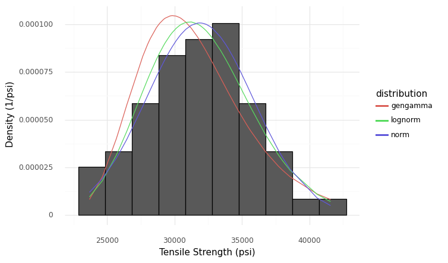
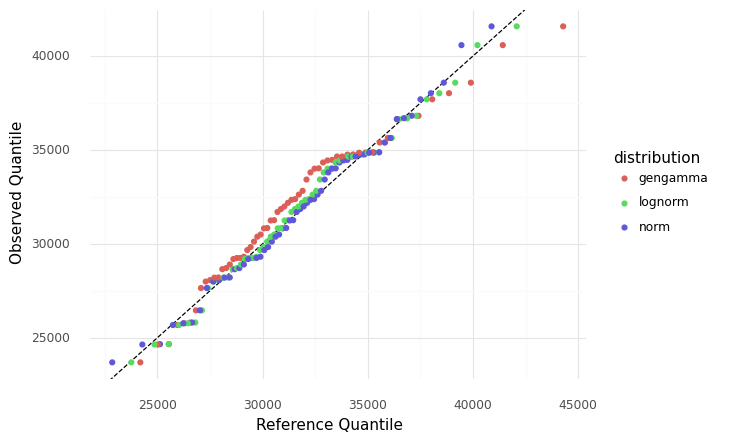
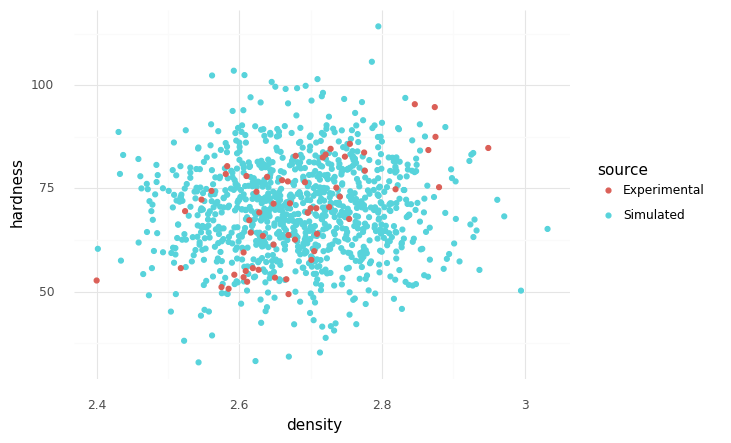
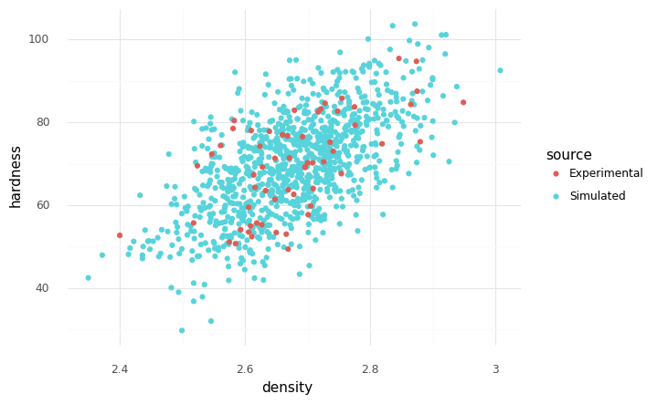

# Random Variable Modeling

---

Random variable modeling is a *huge* topic, but there are some key ideas that are important to know. This short chapter is a brief introduction to random variable modeling.

```python
import grama as gr
DF = gr.Intention()
```

## Random Variables in Grama

Random variables in grama are defined as part of a model. For instance, the following syntax defines a joint distribution for two inputs `x` and `y`.

```python
(
    gr.Model("An example")
    # ... Function definitions
    >> gr.cp_marginals(
        x=gr.marg_mom("norm", mean=0, sd=1),
        y=gr.marg_mom("lognorm", mean=0, sd=1, floc=0),
    )
    >> gr.cp_copula_gaussian(
        df_corr=gr.df_make(var1="x", var2="y", corr=0.5)
    )
)
```

Grama defines joint distributions in terms of *marginals* and a *copula*. This definition is justified by [Skylar's Theorem](https://en.wikipedia.org/wiki/Copula_(probability_theory)#Sklar's_theorem), which states that an arbitrary joint distribution can be expressed in terms of its marginals and a copula. Practically, this modeling approach decomposes random variable modeling into two stages: Modeling the individual uncertainties with marginals, then modeling their dependency with a copula.

## Running Example

As a running example, we will study the built-in die cast aluminum dataset.

```python
from grama.data import df_shewhart
```

## Marginals

Marginal distributions provide a quantitative description of uncertainty for a single quantity. Perhaps the most important factor in modeling a marginal is the shape of the distribution used to describe that quantity; there are often multiple competing distribution shapes that we could pick to fit the same dataset. For instance, the following code fits three different shapes to the `tensile_strength` in the example dataset.

```python
mg_ts_norm = gr.marg_named(
    df_shewhart.tensile_strength,
    "norm", # Normal distribution
)

mg_ts_lognorm = gr.marg_named(
    df_shewhart.tensile_strength,
    "lognorm", # Lognormal distribution
    floc=0, # 2-parameter lognormal
)

mg_ts_gengamma = gr.marg_named(
    df_shewhart.tensile_strength,
    "gengamma", # Generalized gamma distribution
    floc=0, # 3-parameter generalized gamma
)
```

Visualizing the distributions gives three fairly plausible fits to the data:



A more sensitive way to make this comparison is with a QQ plot.

```python
(
    df_shewhart
    >> gr.tf_mutate(
        q_norm=gr.qqvals(DF.tensile_strength, marg=mg_ts_norm),
        q_lognorm=gr.qqvals(DF.tensile_strength, marg=mg_ts_lognorm),
        q_gengamma=gr.qqvals(DF.tensile_strength, marg=mg_ts_gengamma),
    )
    >> gr.tf_pivot_longer(
        columns=["q_norm", "q_lognorm", "q_gengamma"],
        names_to=[".value", "distribution"],
        names_sep="_",
    )

    >> gr.ggplot(gr.aes("q", "tensile_strength"))
    + gr.geom_abline(intercept=0, slope=1, linetype="dashed")
    + gr.geom_point(gr.aes(color="distribution"))
    + gr.theme_minimal()
    + gr.theme(plot_background=gr.element_rect(color="white", fill="white"))
    + gr.labs(x="Reference Quantile", y="Observed Quantile")
)
```



This comparison reveals that the gamma distribution is shifted in its center, while the normal and lognormal fits are both fairly plausible.

## Dependency

Marginals alone do not define a random variable. Dependency describes how values from different variables are related. Independent random variables are specified with an independence copula with `gr.cp_copula_independence()`. This is a common assumption, but it is frequently violated in practice.



A simple way to represent dependency is with a gaussian copula, accessed with `gr.cp_copula_gaussian()`.



Note that it is *critically important* to state your assumptions when modeling random variables! You may have been sent to this page by an error message: That's because grama *requires* you to make your assumptions about dependency explicit.
